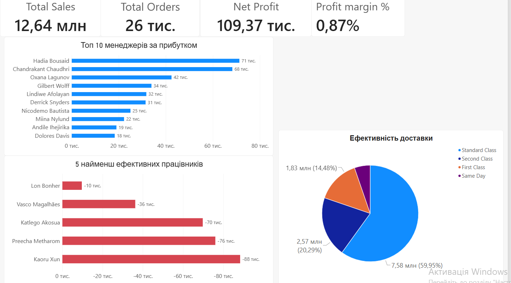

# Багатосторінковий аналітичний звіт дистриб’ютора (Superstore) в Power BI

## Мета проєкту
Розробка комплексного інтерактивного бізнес-звіту в Power BI Desktop на основі історичних даних дистриб’ютора (`superstore_dataset`). Проєкт спрямований на консолідацію фінансових показників, помісячний трендовий аналіз, дослідження впливу комерційних знижок на маржинальність та виявлення факторів операційної ефективності менеджменту.

## Інструменти та етапи реалізації (Power BI Stack)
* **Екстракція та трансформація даних (Power Query / ETL):** Корекція імен таблиць, очищення структури заголовків, обробка порожніх значений (`null`) та заміна їх на валідні текстові заповнювачі (`no code`, `non US`). Згенеровано складені унікальні сурогатні ключі адреси (Код + Місто) для забезпечення цілісності зв'язків.
* **Моделювання даних & DAX:** Побудовано архітектуру бази даних за схемою **"Зірка" (Star Schema)**. Створено кастомну системну таблицю дат (**Calendar Table**) для часового аналізу та сформовано продуктові та регіональні ієрархії.

## Перелік розрахованих бізнес-мір (DAX Measures)
* **Загальний обсяг продажів** (`Total Sales` — 12,64 млн)
* **Загальний прибуток** (`Total Profit` / `Net Profit` — 109,37 тис.)
* **Загальна кількість замовлень** (`Total Orders` — 26 тис.)
* **Відносний прибуток, %** (`Profit Margin %` — 0,87%)
* **Прибуток рік-до-року** (`Profit YoY Growth` за допомогою Time Intelligence)

---

## Структура аналітичного звіту (Вкладки)
Звіт містить 6 спеціалізованих аналітичних сторінок:
1. **Загальний огляд фінансів:** Головні агреговані KPI компанії та макроаналіз продажів.
2. **Деталі відвантажень:** Оцінка логістичних процесів та обсягів поставок.
3. **Помісячний аналіз:** Глибока матрична візуалізація продажів, витрат та прибутків з YoY-метриками.
4. **Аналіз знижок:** Дослідження впливу дисконтних програм на рівень чистого прибутку.
5. **Фактори ефективності:** Рейтинг ТОП-10 найкращих менеджерів за прибутком, аналіз 5 найменш ефективних працівників для оптимізації HR-процесів та кругова діаграма структури ефективності доставки за класами відправлень.
6. **Перелік замовлень (Прихована сторінка Drillthrough):** Деталізована таблиця транзакцій для точкової перевірки аномалій.

### Візуалізація сторінки "Фактори ефективності" в Power BI:

## Бізнес-цінність проєкту
Дашборд повністю автоматизує фінансову та операційну звітність дистриб’ютора. Аналіз факторів ефективності дозволяє керівництву миттєво бачити лідерів продажів серед менеджерів, локалізувати збитки від найменш продуктивних співробітників, оцінювати частку витрат на різні класи доставки (наприклад, Standard Class займає 59,95%) та оперативно оптимізувати комерційну стратегію компанії.
